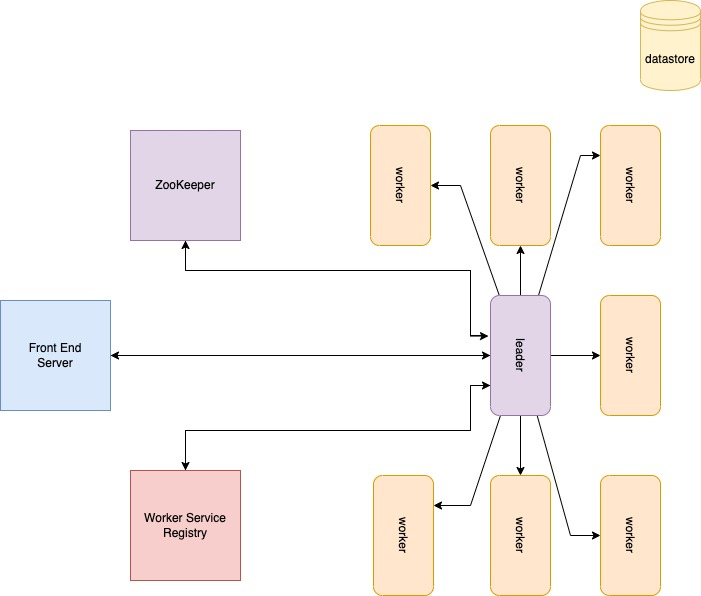

# Parallel Search
--- 
### Overview
A Distributed System for querying and searching documents using TF-IDF algorithm.

### System Architecture 
<div align="center">
	
	<p align="center">Fig 1. <i>An overview of system design</i></p>
</div>

**Working**
1. Zookeeper elect a leader among the workers and register them in service registry.
2. The leader register itself with different Znode to make it available for front end server.
3. Once the input query received in front end server, send it to coordinator service registry aka worker service registry and the leader forward the task to all the worker in the registry using http request.
4. The worker nodes collect the documents from the datastore and perform the search task for computing the result and send it to leader.
5. The leader perform aggregation, scoring and sorting, and send the result back to front end server.

### Tech Stack
- _Programming Language:_ _`Java`
- _Development:_ _`Apache ZooKeeper`,  `Protobuf`,  `JavaScript`.

###  Running Guide

**Prerequisites:** [Install ZooKeeper](https://zookeeper.apache.org/releases.html)
1. Build both the projects.

```bash
mvn clean install
```

2. Open 'n' terminals ( n = number of cluster/worker nodes).
3. Run the generated jar file of cluster node project in all terminals with different ports.

```bash
java -jar target/distributed.search-1.0-SNAPSHOT-jar-with-dependencies.jar 8080
```

4. Run the generated jar file of front end project in another terminal.

```bash
java -jar target/front.end-1.0-SNAPSHOT-jar-with-dependencies.jar 9000
```

5.  Open the browser and go to localhost:9000 to perform the search query.